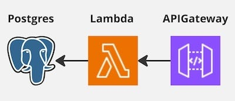
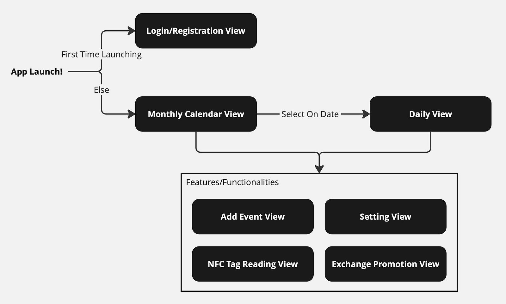

# Office Attendance Calendar/Scheduling App

## Project Overview
- Backend: Postgres + Lambda + APIGateway written in Rust ([YAML for API Endpoints](itsuki_calendar_backend/api_doc/reference/ItsukiCalendarAPI.yaml))  

- iOS App: SwiftUI 

## Features
- Add the date you are planning on going to the office
- Check who else is going to the office on a specific date
- Scan An NFC Tag that will potentially locate in the office to mark your office attendance
- Earn points for your attendance and exchange it for Promotion Codes (Apple, GooglePlay, or whatever you decided to add)

---
Please refer to [my Medium Blog](https://medium.com/@itsuki.enjoy/swiftui-rust-an-office-attendance-calendar-scheduling-app-project-679b2e6be623) for more details!

